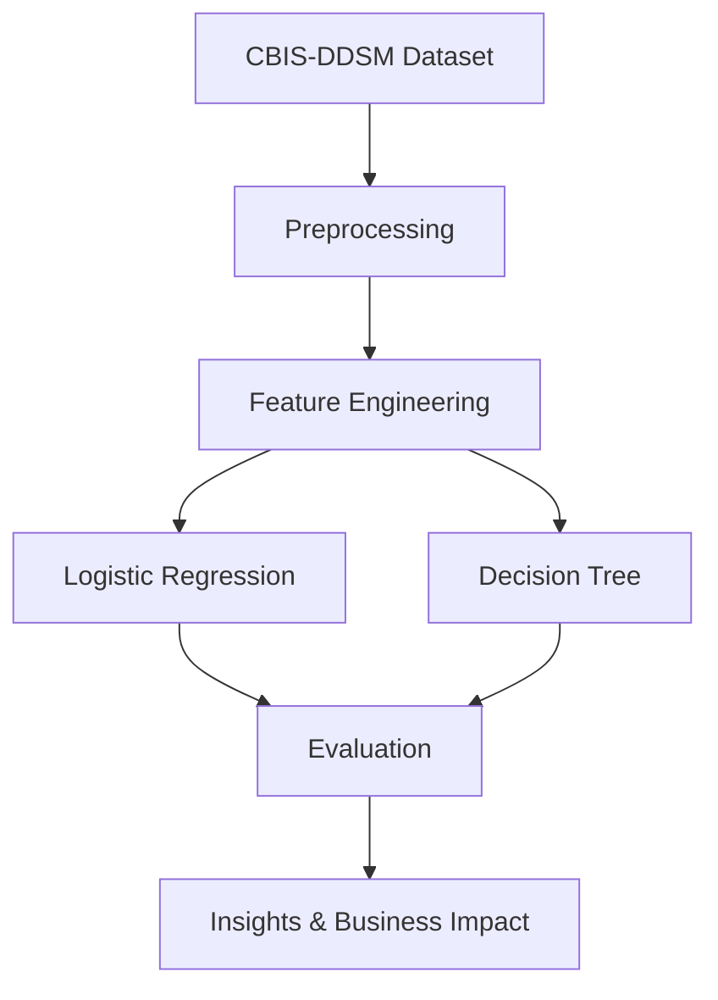

# 🩺 Breast Cancer Detection using AI

AI and machine learning project leveraging the **CBIS-DDSM mammography dataset** to enhance early breast cancer detection accuracy and assist radiologists in diagnosis.

## 🎯 Objective
Develop ML models to analyze mammogram metadata and improve diagnostic accuracy for early detection.

## ❌ Problem
- High variability in breast cancer diagnoses  
- Limited radiologists in remote areas  
- Risk of overdiagnosis/underdiagnosis  
- Time-consuming manual interpretation  

## ✅ Approach
- Dataset: CBIS-DDSM (10K+ rows, 52 features)  
- Preprocessing: handled missing values, feature encoding, normalization  
- Models: Logistic Regression & Decision Tree  
- Evaluation Metrics: Accuracy, ROC-AUC, F1-score  

## 📊 Results
- **Logistic Regression** → Accuracy: 96.44%, ROC-AUC: 85.4%  
- **Decision Tree** → Accuracy: 96.58%, ROC-AUC: 98.59% (best performer)  

## 🔄 Flowchart


## 🚀 How to Run
```bash
# Clone repo
git clone https://github.com/yourusername/Breast-Cancer-Detection-AI.git
cd Breast-Cancer-Detection-AI

# Install dependencies
pip install -r requirements.txt

# Open notebook
jupyter notebook notebooks/breast_cancer_detection.ipynb
```

## 📈 Business Impact
- Supports **early detection** and risk-based screening  
- Assists radiologists in prioritizing cases  
- Reduces costs by catching malignancies earlier  
- Scalable AI solution for healthcare accessibility  

---
