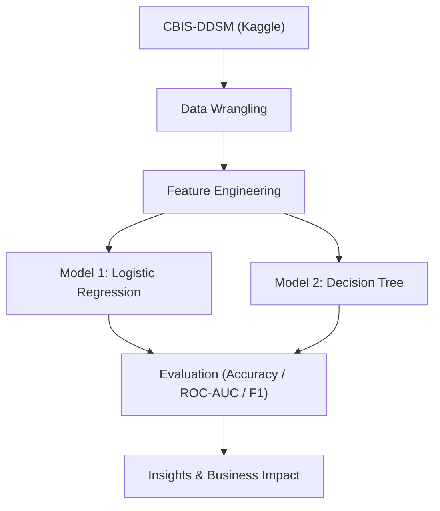

# 🩺 Breast Cancer Detection using AI

AI and machine learning project leveraging the **CBIS-DDSM mammography dataset** (sourced from Kaggle) to enhance early breast cancer detection accuracy and assist radiologists in diagnosis.

---

## ❗ Problem Statement
Breast cancer is a leading cause of cancer-related deaths among women. Early detection via mammography improves outcomes, but manual interpretation is time-consuming and can be inconsistent. This project builds an **ML pipeline to classify mammogram cases (benign vs malignant)** and support faster, more accurate decisions.

---

## 🎯 Objectives
- **Automate detection:** Train models to classify benign vs malignant cases.
- **Improve accuracy:** Minimize false negatives that delay treatment.
- **Data wrangling & features:** Clean, encode, and engineer informative variables.
- **Model comparison:** Evaluate **Logistic Regression** and **Decision Tree**.
- **Practical use:** Provide a simple, reproducible workflow for healthcare analytics.

---

## 📊 Dataset Details
- **Source:** CBIS-DDSM (Curated Breast Imaging Subset of DDSM), available on Kaggle  
  🔗 [CBIS-DDSM on Kaggle](https://www.kaggle.com/datasets/skooch/ddsm-mammography)
- **Type:** Curated mammography cases with annotations.
- **Labels:** Benign / Malignant (with pathology confirmations).
- **Features:** Breast density, pathology labels, ROI/image metadata, etc.
- **Why this dataset:** A widely used benchmark for breast imaging research.

---

## 🔧 Approach
1. **Data Preparation**
   - Handle missing values, encode categorical variables, normalize where needed.
   - Train/validation split with preserved class balance.
2. **Modeling**
   - **Logistic Regression** and **Decision Tree** baselines.
3. **Evaluation**
   - Metrics: **Accuracy, ROC-AUC, Precision/Recall, F1-score**.
   - Confusion matrix analysis to assess false negatives/positives.
4. **Reporting**
   - Notebook with EDA, feature prep, model training, metrics, and insights.

---

## 📈 Results
- **Logistic Regression** → Accuracy: **96.44%**, ROC-AUC: **85.4%**  
- **Decision Tree** → Accuracy: **96.58%**, ROC-AUC: **98.59%** *(best performer in this study)*

> Note: Results depend on preprocessing choices, feature set, and random seeds.

---

## 🔄 ML Pipeline Flowchart


---

## 🚀 How to Run
```bash
# 1) Clone the repo
git clone https://github.com/<your-username>/Breast-Cancer-Detection-AI.git
cd Breast-Cancer-Detection-AI

# 2) (Optional) Create & activate a virtual environment
python -m venv .venv && . .venv/Scripts/activate   # Windows
# or
python -m venv .venv && source .venv/bin/activate  # macOS/Linux

# 3) Install dependencies
pip install -r requirements.txt

# 4) Open the notebook
jupyter notebook notebooks/breast_cancer_detection.ipynb
```

---

## 🗂️ Project Structure
```
Breast-Cancer-Detection-AI/
├─ notebooks/
│  └─ breast_cancer_detection.ipynb   # EDA, preprocessing, modeling, results
├─ reports/
│  ├─ Final_Report.pdf                # Written report
│  └─ Project_Presentation.pdf        # Slide deck
├─ requirements.txt                   # Dependencies
├─ LICENSE                            # MIT
└─ README.md
```

---

## 🧠 Business Impact
- **Earlier detection** improves outcomes and reduces treatment costs.
- **Decision support** for radiologists to prioritize high-risk cases.
- **Scalable workflow** that can be extended with imaging models or new features.

---

## 📌 Notes & Next Steps
- Add additional models (Random Forest, XGBoost) and compare robustness.
- Consider cross-validation and calibration for probability-based decisions.
- Extend to imaging pipelines (CNNs) using ROI images when feasible.

---

## 🔖 License
This project is released under the **MIT License** (see `LICENSE`).
